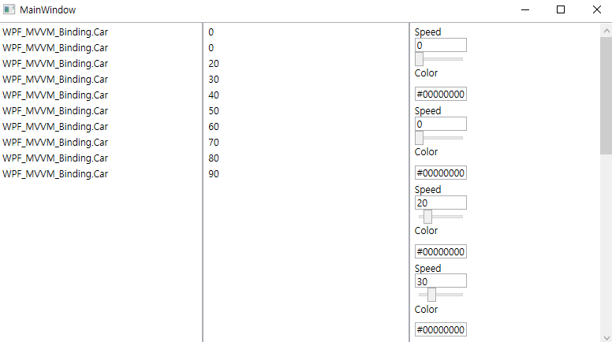

# Data Binding

- BasicBinding.xaml : Chapter 4.1 예제 코드

  

- Converter.xaml : Chapter 4.3 예제 코드, TextBlock Control에 Value 속성을 넣으라고 되어 있지만 TextBlock에 Value 속성이 없어 결과 확인이 불가능 함

- listBinding.xaml : Chapter 4.4, 4.5 예제 코드

  

