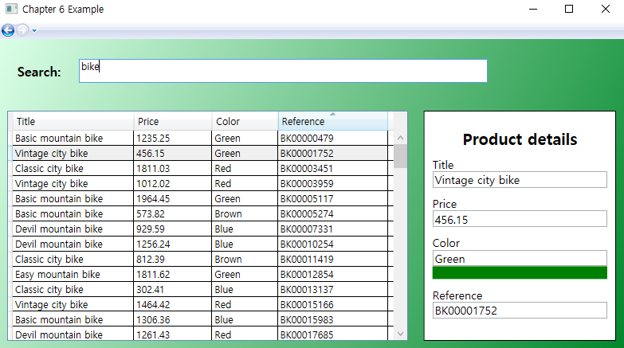

# Chapter 6 연습문제

Chapter 5 연습문제의 연장

기존의 ProductManagement 페이지를 MVVM 패턴으로 변환하여 구현

- 기존
  - ProductManagement.xaml
- 변경
  - ProductManagementMVVM.xaml (View)
  - ProductManagementMVVMViewModel.cs (View Model)

View를 담당하는 xaml  파일에는 기본적인 UI와 Binding을 위한 Data Context를 부르는 것 외에 다른 기능적인 C# 코드가 들어가 있지 않다. 기능적인 부분은 View Model을 담당하는 cs 파일에 들어가 있다.

### 실행 결과

내부적으로는 MVVM 패턴을 적용하여 달라졌지만 외부적으로 보기에는 딱히 달라진 점을 찾을 순 없다.