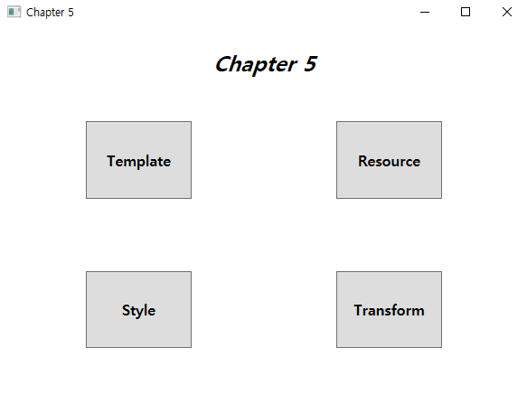
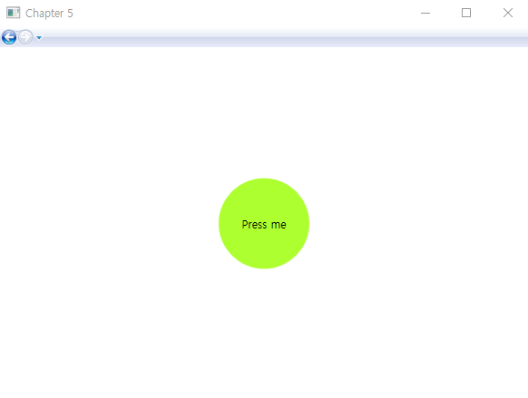
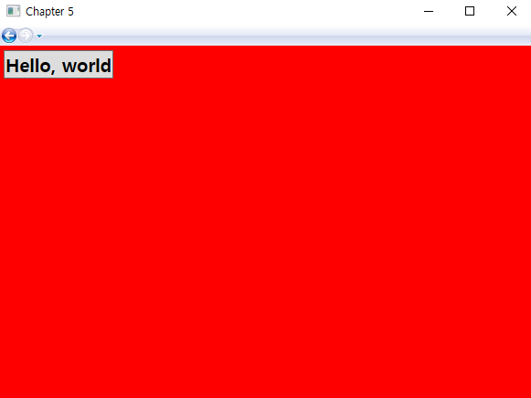
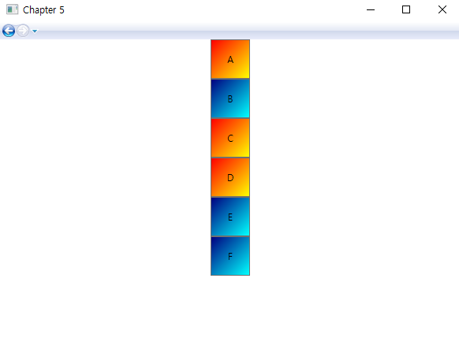
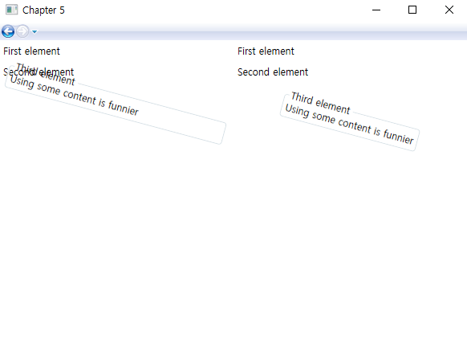

# Chapter 5  - 사용자 스타일 적용

- Template : 하나의 Control에 대한 모양을 정의 할 때 사용
- Resource : key 값을 사용하여 정의된 Resource는 동일한 Type의 여러 Control에 적용 가능 
- Style : Resource와 비슷하지만 다중 속성을 설정 할 수 있음
- Transform : Control를 회전, 이동, 기울이기 등 형태를 변환 시킬 때 사용

### <실행 결과>

- Menu Page

- Template Page

  

- Resource Page

  

- Style Page

  

- Transform Page

