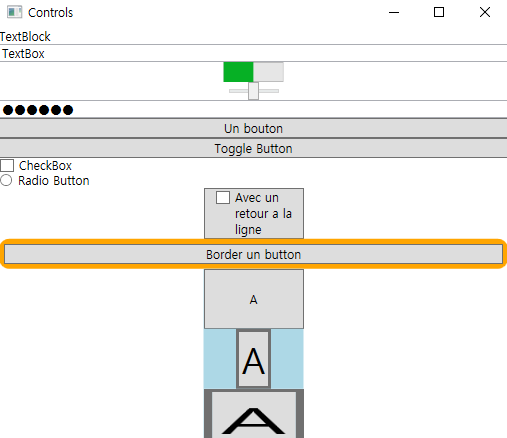

# WPF Controls (Chapter 3.3 ~ 3.4)

### Basic Control

----------------

- TextBlock :  Label 과 유사하게 수정 불가능한 Text를 나타낼 때 사용하는 Control, Text 표현 시 Label 보다 TextBlock 선호
- TextBox :  수정 가능한 Text를 입력하는 Contorl
- ProgressBar : 진행 상황을 보여주는 Control
- Slider : 범위를 조절할 수 있는 Control
- PasswordBox : 외부에 노출시키지 않을 Text를 입력하는 Control

### Content Control

----------------------------

- Button : Click이 가능한 Control
- ToggleButton : Click마다 상태가 반전되는 Control
- CheckBox : 그룹 내에 여러 요소들을 선택할 수 있는 Control
- RadioButton :  그룹 내에 요소들 중 하나를 선택할 수 있는 Control
- Border : Control의 외각부분을 표현해줌
- ScrollViewer : Control에 Scroll을 추가해줌
- ViewBox : 하위 Control의 크기를 전체적으로 조정해줌, 각각의 Control의 크기를 조정하려면 Layout 사용

### 실행 결과

