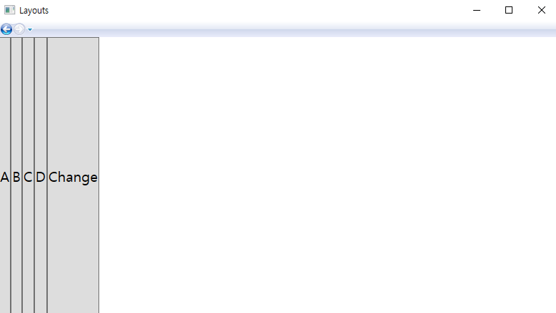

# WPF Layouts Chapter 3.13

- Canvas : 위치를 사용하여 Control을 배치할 수 있는 Layout
- Stack Panel : 원하는 방향으로 Control들을 쌓아 보여주는 Layout 
- Dock Panel : 상하좌우의 영역을 구분할 수 있는 Layout
- Uniform Grid : 따로 Row, Column을 지정하지 않아도 자동적으로 Grid Layout 형태로 맞춰줌
- Grid : Row, Column을 따로 설정하고 원하는 영역에 Control을 배치할 수 있는 Layout

### 실행 결과

##### < LayoutMenus.xaml >

##### < Canvas.xaml >

##### < StackPanel.xaml>

##### < DockPanel.xaml >

##### < UniformGrid.xaml >

##### < Grid.xaml >

