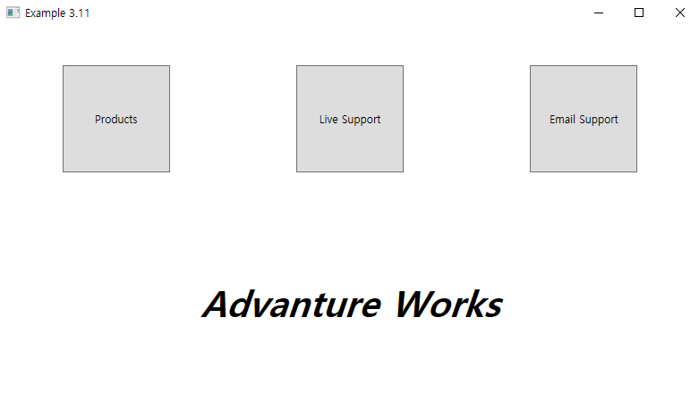
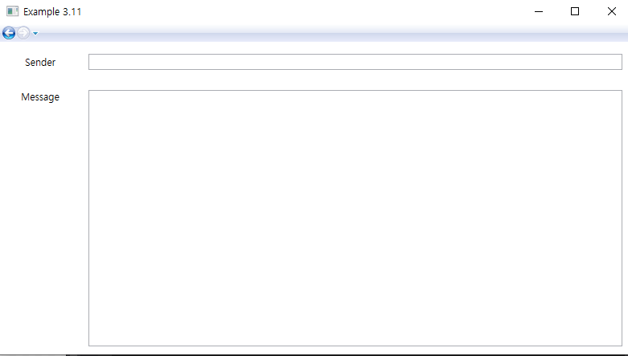

# 연습 문제 3.11 - 메뉴페이지 생성

연습 문제 3.7의 연장

새로운 Menu Page를 생성하고 3개의 Button Control 추가, 이 중 Email Support 버튼에 이벤트를 추가하여 클릭 시 지난 예제에서 만든 Contact 페이지로 이동하도록 구현

MainWindow.xaml에서 Frame의 Source를 Contact.xaml에서 Menu.xaml로 변경

### 실행 결과

##### < Menu Page >

##### < Contact Page >

Menu 페이지에서 Email Support 버튼 클릭 시 Contact 페이지로 이동

