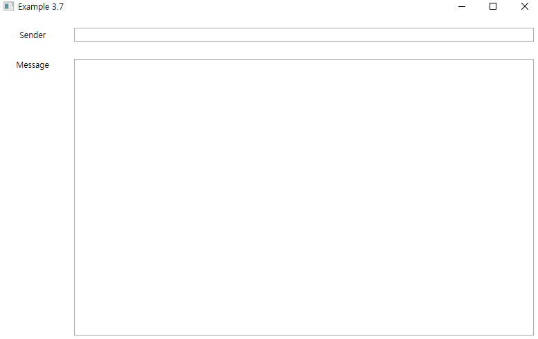

# 연습문제 3.7 - 애플리케이션과 연락처 페이지 생성

MainWindow.xaml에서는 Frame을 사용하여 연락처 페이지를 띄워 줌

새로운 페이지를 추가하여 연습 문제의 결과 화면과 유사하게 연락처 페이지를 구현

연락처 페이지 구현 시 책에서는 도구 상자를 사용하여 Control들을 추가하고 위치를 조정하였지만 실제 구현 시 Grid Layout을 사용하여 Control들을 배치함

### 실행 결과

