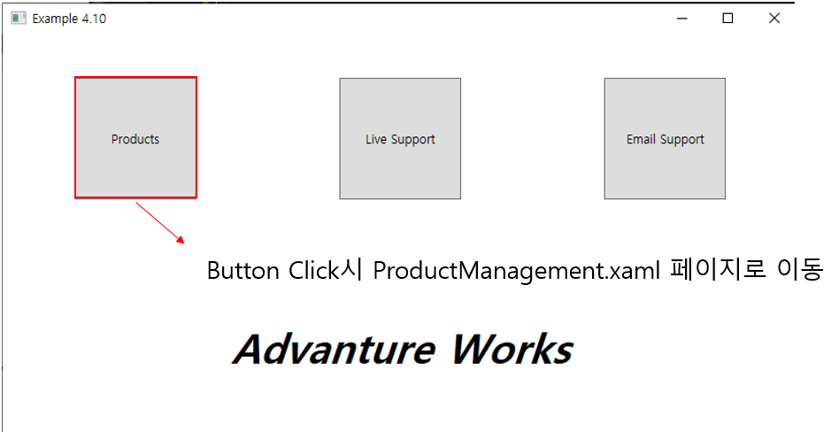
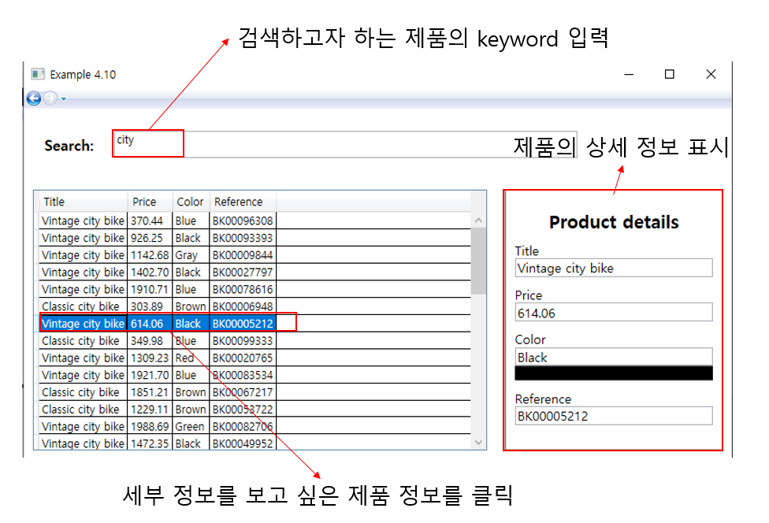

# 연습 문제 4.10 - 제품 및 세부 정보 표시

연습 문제 4.6 이후 다음 부분 구현

4.6 연습 문제 때 받은 풀이 소스에서 StartAssets 디렉토리에 있는 Notifier.cs와 ProductFactory.cs 파일을 프로젝트 솔루션에 추가하고 진행

찾을 제품의 키워드를 검색하면 제품 목록과 제품에 대한 세부 정보를 나타내주는 ProductManagemet.xaml 페이지 추가

### 실행 결과

