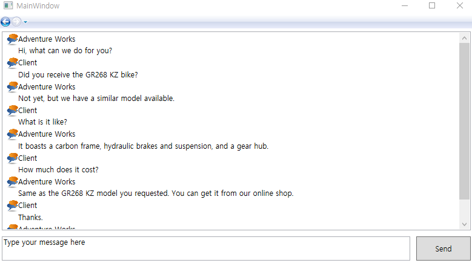

# 연습 문제 4.6 - 데이터 객체의 메시지 표시

연습 문제 3.15 이후 다음 부분 구현

연습문제 풀이 소스(https://bitbucket.org/epobb/learnwpfexercises/src/master/)를 다운 받고 StartAssets 디렉토리에 있는 Talk.cs와 chat.png 파일을 프로젝트 솔루션에 추가하고 진행

discussion.xaml 파일의 ListBox 영역에 Talk.cs에 있는 data를 가져와서 바인딩하는 예제

### 실행결과

