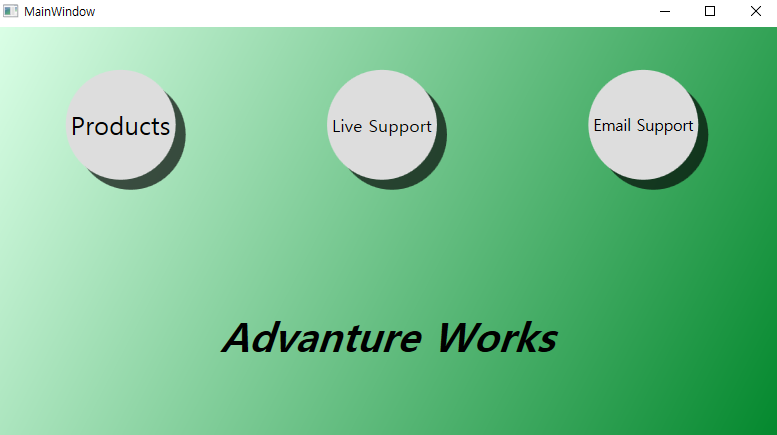
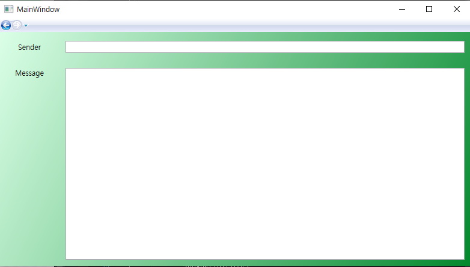
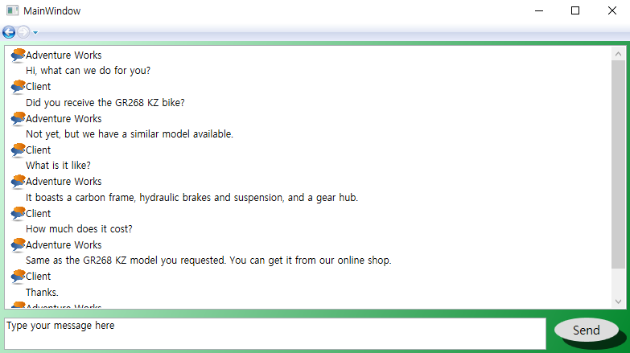
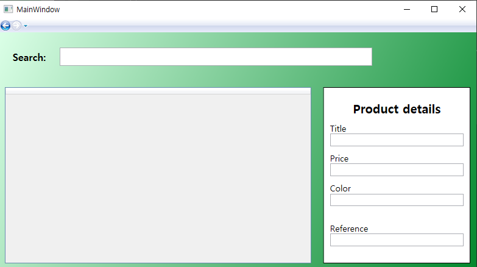

# Chapter 5 연습 문제

- 연습 문제 5.2 : Discussion Page의 Send Button Template 적용

- 연습 문제 5.5 : Background Resource 정의 후 모든 페이지에 적용

- 연습 문제 5.8 : Menu Page Button에 암시적 스타일 적용 - 연습 문제 5.2의 Button Template

  

### < 실행 결과 >

